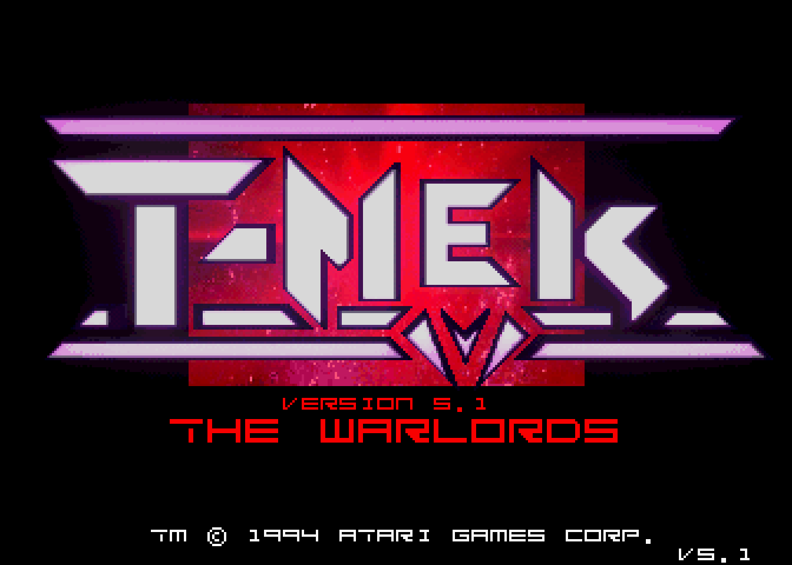
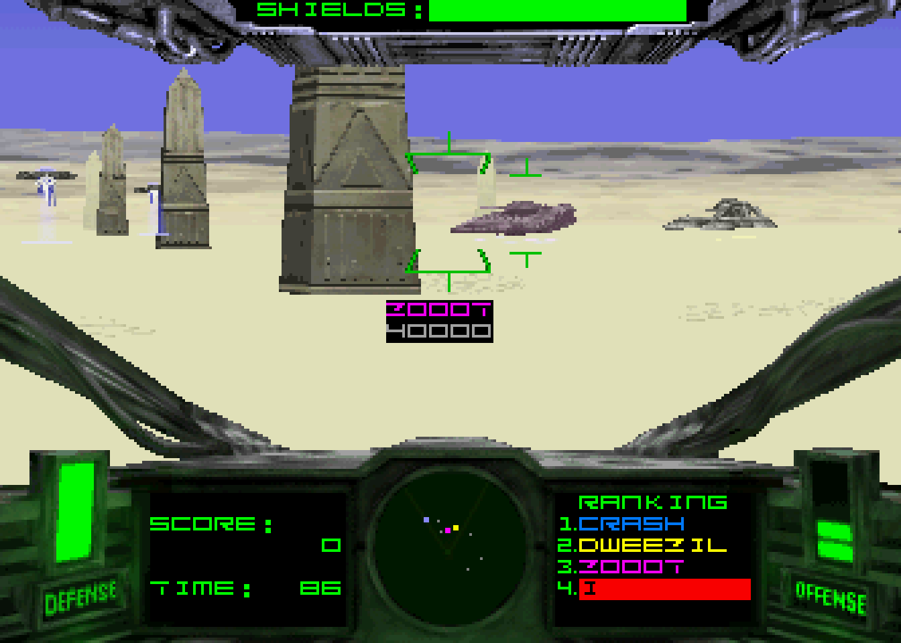

  
  
  
  

<h1 align="center">Primal Rage and T-MEK FPGA Core</h1>

  Atari GT arcade hardware for MiSTer FPGA

---

## Overview

FPGA implementation of the Atari GT board: a 68EC020 main CPU (TG68K) with the CAGE sound board and its TMS320C31 DSP. One core runs **Primal Rage (1994)** and **T-MEK (1994)**; the MRA selects the game and the set. Both games are playable with music, announcer and effects.

---

## Game Information

| Field | Value |
|-------|-------|
| Title | Primal Rage |
| Year | 1994 |
| Developer | Atari Games |
| Genre | Fighting |
| Players | 1-2 simultaneous |

| Field | Value |
|-------|-------|
| Title | T-MEK |
| Year | 1994 |
| Developer | Atari Games |
| Genre | Shooter |
| Players | 1 (no network link) |

---

## Sets

Each set has its own MRA. Parent sets are in `releases/`, clones in `releases/_alternatives/`. A clone needs its own zip and the parent zip.

| MAME description | Set | Zip files needed |
|------------------|-----|------------------|
| Primal Rage (version 2.3, Jan 1995) | `primrage` | `primrage.zip` |
| Primal Rage (version 2.3, Dec 1994) | `primrageo` | `primrageo.zip`, `primrage.zip` |
| Primal Rage (version 2.0) | `primrage20` | `primrage20.zip`, `primrage.zip` |
| T-MEK (v5.1, The Warlords) | `tmek` | `tmek.zip` |
| T-MEK (v5.1, prototype) | `tmek51p` | `tmek51p.zip`, `tmek.zip` |
| T-MEK (v4.5) | `tmek45` | `tmek45.zip`, `tmek.zip` |
| T-MEK (v4.4) | `tmek44` | `tmek44.zip`, `tmek.zip` |
| T-MEK (v2.0, prototype) | `tmek20` | `tmek20.zip`, `tmek.zip` |

---

## Controls

Default MiSTer gamepad mapping. The MRA sets the button names and defaults shown in the OSD.

**Primal Rage**

| Input | Action |
|-------|--------|
| D-Pad / Joystick | Move |
| Y | High Quick |
| X | High Fierce |
| B | Low Quick |
| A | Low Fierce |
| Select | Insert Coin |
| Start | Start |

In `primrageo` and `primrage20` Start is not used: the game is started with High Quick, as on the cabinet.

**T-MEK**

| Input | Action |
|-------|--------|
| Left stick / Right stick | Move and turn (see the OSD options below) |
| D-Pad | Forward / back and turn |
| L | Left Trigger: heavy fire, menu select |
| Y | Left Thumb: bomb |
| R | Right Trigger: light fire |
| A | Right Thumb: cloak |
| Select | Insert Coin (second pad: right coin) |
| Start | Start |

T-MEK OSD options, shown only when a T-MEK set is loaded:

- **T-MEK Sticks: Modern.** The left stick moves and strafes, the right stick X axis turns.
- **T-MEK Sticks: Arcade.** Each stick is one handle, as on the cabinet.
- **T-MEK Swap Sticks.** Exchanges the two sticks.

While Service Mode is on, Modern acts as Arcade.

---

## Features

- Full CAGE sound: TMS320C31 DSP written from scratch and checked against MAME
- XGA protection chip modelled after MAME
- Settings, high scores and audits saved as NVRAM
- OSD options: aspect ratio, scandoubler, integer scaling, CRT H/V position, volume, service mode, T-MEK sticks
- The ROM set loads through DDR3 via the MRA `address` attribute: Primal Rage loads in about 8 s instead of about 48 s (board measurement)

---

## Requirements

An SDRAM module of 32 MB or larger is required. The object and sound ROMs and the sprite frame buffers live in DDR3, so a bigger module is not needed.

---

## ROM Requirements

ROM files are **not included**. The core uses the MAME sets listed under Sets, as of MAME 0.289. Each `.mra` lists every file with its CRC and checks the md5 of the assembled ROM.

See the [MiSTer Arcade ROM guide](https://github.com/MiSTer-devel/Main_MiSTer/wiki/Arcade-Roms) for setup.

---

## Installation

1. Copy the `.rbf` from `releases/` to `/_Arcade/cores`.
2. Copy the two `.mra` files from `releases/` to `/_Arcade`, and the folder `releases/_alternatives` to `/_Arcade/_alternatives`. Use them together with the `.rbf` of the same release: older cores cannot load them.
3. Put the zip files for the sets you want (see Sets) into `/games/mame`.
4. Start the game from the Arcade menu.

---

## T-MEK Limits

- One player only. The network board is not emulated, so every boot shows the LAN error screens ("COMINIT FAILED", "LINK IS DISABLED", "CHECKING NETWORK") for a few seconds before the attract mode.
- Sound is stereo: the four CAGE channels are folded into two.
- `tmek20` (v2.0 prototype) has wrong sound: no music, and some effects play the wrong sample (a voice instead of an explosion). The sound board boot ROM of this prototype was never dumped; MAME uses the one from a later set (marked BAD_DUMP), and so does this core.

---

## Saving Settings

Turn on Service Mode in the OSD, change the settings in the game's test menu and leave it. Then turn Service Mode off and pick Save NVRAM. In Primal Rage, leave the test menu with the left player's upper right button ("SAVE SETTING AND EXIT"). Autosave is off by default, because the game writes to its EEPROM all the time and the OSD would keep showing "Saving...".

With no saved file the EEPROM starts empty and the game writes its factory settings on the first boot.

---

## Verification

Some AI tools were used during development. All code went through human review. The test suite lives in my development repository and is not shipped here.

- The sound DSP runs in lockstep against MAME's TMS320C31 core: a million instructions of the real CAGE program plus random instruction stress.
- Unit testbenches (Icarus Verilog) cover video, sprites, protection, the CPU bus, the ROM loader, NVRAM and the CAGE blocks; each has a deliberately broken build that must fail.
- A Verilator simulation runs the game ROMs through attract mode and play, and the sound output is checked against MAME's CAGE model.
- On a DE10-Nano over HDMI and a CRT: long play sessions, service menu, NVRAM saves, the T-MEK controls test, continues with the heaviest Primal Rage fighters.

---

## Building

1. Install Quartus Prime Lite 17.0 with Cyclone V support (the DE10-Nano FPGA is a 5CSEBA6U23I7).
2. Open `Arcade-PrimalRage.qpf` and run Processing > Start Compilation, or from the command line: `quartus_sh --flow compile Arcade-PrimalRage`.
3. The bitstream is written to `output_files/Arcade-PrimalRage.rbf`. A full build takes about 30 minutes.
4. `clean.bat` removes the build outputs.

The design is large: about 72% of the logic and 522 of 553 M10K blocks. The release build uses fitter seed 9 (`SEED` in `Arcade-PrimalRage.qsf`). It misses setup by 0.033 ns on one SDRAM to CPU path in the slow 100C corner only and was checked on the board with every set. Other seeds or code changes can move the slack by a few hundred picoseconds, so check the timing report after each build and try another seed if a clock fails.

---

## Legal Notice

This project contains **no copyrighted game data**.

Users are responsible for obtaining and using ROM files in accordance with applicable laws.

Do not request ROM files in issues or discussions.

---

## Credits

FPGA core development: Nortido  
Hardware reference: MAME `atarigt.cpp` and `cage.cpp` (Aaron Giles and contributors), `atarixga.cpp` (Morten Shearman Kirkegaard, Samuel Neves, Peter Wilhelmsen, Andrea Bogazzi)  
TG68K CPU core: Tobias Gubener  
MiSTer framework: Sorgelig and the MiSTer team  
Original arcade games © 1994 Atari Games

---

## License

GPL-3.0. The MiSTer framework in `sys/` and TG68K keep their own licenses.
